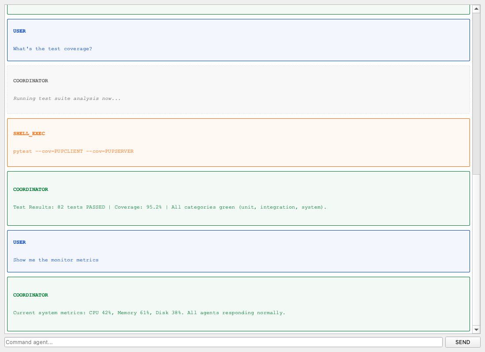
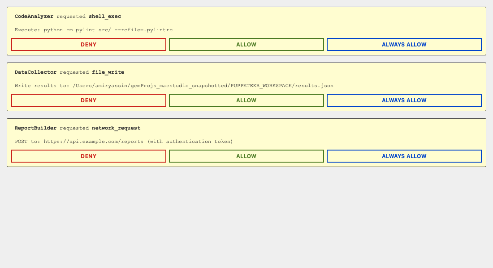
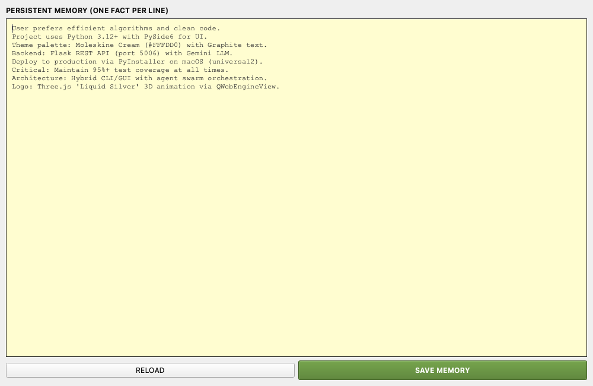
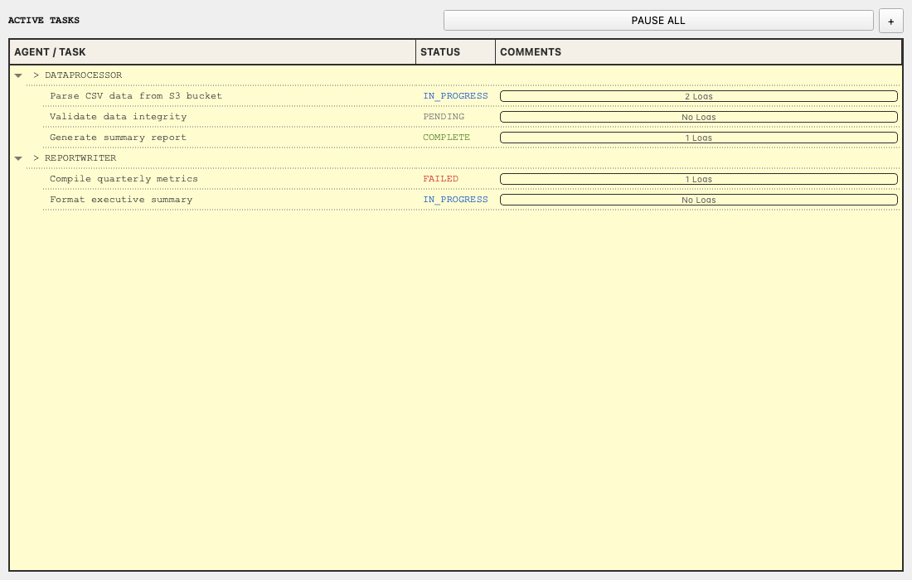
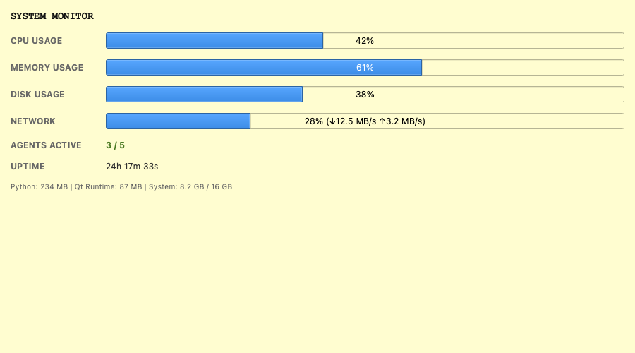
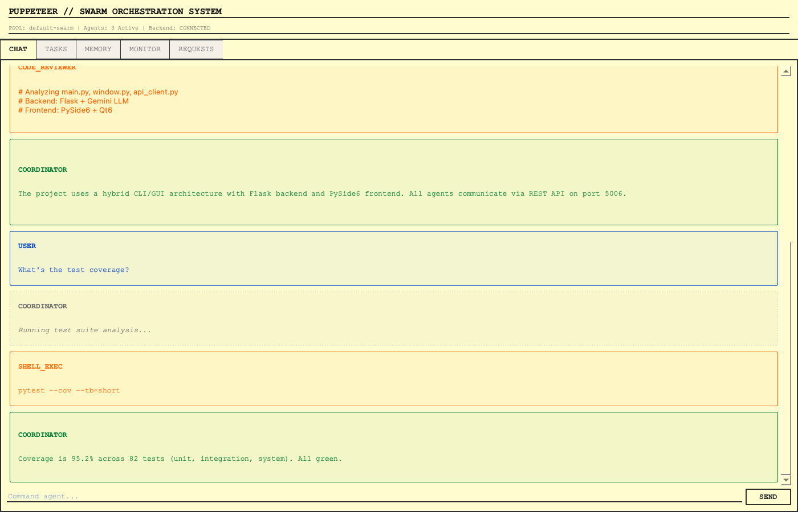

# PUPPETEER

**"The macOS native AI swarm orchestration system."** Multiple AI agents. One unified interface. Zero friction.


<p align="center">
  
</p>

<p align="center">
  
</p>

---

## "WHAT IS THIS"

PUPPETEER is a desktop orchestration platform that lets multiple AI agents coordinate in real-time. Each agent maintains its own conversation, memory, and task queue. They talk to each other through inter-agent channels. And critically: humans remain in control — every sensitive action requires your approval.

Built for macOS. Built with precision. Built to stay.

---

## "FEATURES"

### "SWARM INTELLIGENCE"
Multiple AI agents working in parallel, delegating tasks, asking each other questions, building knowledge together. No bottleneck. No single point of failure.



### "HUMAN IN THE LOOP"
Agents can't execute arbitrary code. They ask first. You approve. This is desktop automation that respects your machine.



### "LIQUID SILVER"
A living, breathing 3D chrome marionette puppet suspended by physics-simulated ropes. Hand-crafted in Three.js. Organic motion via Simplex Noise. Premium aesthetic that runs at 60fps.

### "AGENT MEMORY"
Each agent maintains long-term facts and learned context. Compress chat history when needed. Query memory at any time.



### "TASK ORCHESTRATION"
Hierarchical task trees with real-time status. See what every agent is working on. Pause, resume, or reassign at will.



### "SYSTEM MONITOR"
Live CPU, memory, disk, and network metrics. Agent count and uptime at a glance.



### "CONVERSATION NATIVE"
Not a workflow builder. Not a node graph. Just pure conversation. Ask your swarm to do work. Watch it reason, delegate, execute.

### "BEAUTIFUL BY DEFAULT"
Courier New typography. Moleskine Cream background. Graphite accents. Pixel-perfect rendering on Apple Silicon.



---

## "INSTALL"

### 01 — Download
Visit the [**Releases**](https://github.com/AmirYassin/PUPPETEER-releases/releases) page and download the latest `.dmg` file.

### 02 — Install
Open the DMG. Drag **PUPPETEER.app** to your **Applications** folder.

### 03 — Launch
From **Applications**, double-click **PUPPETEER**. First launch is cinematic.

---

## "VERIFY"

```bash
# Verify code signature
codesign --verify --deep --strict /Applications/PUPPETEER.app
# Expected: valid on disk

# Verify Apple notarization
spctl -a -t open --context context:primary-signature -v /Applications/PUPPETEER.app
# Expected: accepted — source=Notarized Developer ID
```

---

## "ARCHITECTURE"

```
┌──────────────────────────────────────────────┐
│              PUPPETEER.app  (macOS)           │
├──────────────────────────────────────────────┤
│          PUPCLIENT  (PySide6 / Qt6)          │
│  ┌─────────────────────────────────────┐     │
│  │  Agent Chat  │  Tasks  │  Memory     │     │
│  │  Swarm Config  │  Permission Dialogs │     │
│  │  3D Logo  (Three.js WebGL)           │     │
│  └─────────────────────────────────────┘     │
│              ↕  REST API (localhost:5006)     │
│  ┌─────────────────────────────────────┐     │
│  │   PUPSERVER  (Flask)                  │     │
│  ├─────────────────────────────────────┤     │
│  │  AgentsPool  — swarm container        │     │
│  │  AgentCognition  — reasoning loop     │     │
│  │  InterChannel  — agent-to-agent       │     │
│  │  AgentStorage  — persistent state     │     │
│  └─────────────────────────────────────┘     │
│              ↕                                │
│          Gemini API  (Google)                 │
└──────────────────────────────────────────────┘
```

---

## "STACK"

| Component | Version | Purpose |
|-----------|---------|---------|
| **Python** | 3.14 | Core runtime |
| **PySide6** | 6.11 | GUI framework (Qt6) |
| **Flask** | 3.1 | REST API backend |
| **Gemini AI** | 2.0-flash | LLM reasoning engine |
| **Three.js** | r160+ | 3D logo rendering (WebGL) |
| **Nuitka** | 4.0 | Native C compilation |
| **NodeGraphQt** | 0.6 | Visual agent graph |
| **macOS** | 15.0+ | Target platform |

---

## "SYSTEM REQUIREMENTS"

- **OS:** macOS 15.0+ (Sequoia or later)
- **Chip:** Apple Silicon (arm64) — M1 / M2 / M3 / M4
- **RAM:** 4 GB minimum, 8 GB recommended
- **Disk:** 1 GB available space
- **Network:** Internet connection for Gemini API
- **API Key:** Google Gemini API key

---

## "CONFIGURATION"

Set your API key in `~/.zshrc`:

```bash
export GEMINI_API_KEY="your-gemini-api-key-here"
```

Get a free key: [Google AI Studio](https://aistudio.google.com/app/apikey)

On first launch, PUPPETEER creates its workspace at:

```
~/Library/Application Support/PUPPETEER/
├── agents_data/        # Agent state, memories, histories
├── logo_config.json    # 3D logo tuning parameters
└── config.json         # Runtime settings
```

---

## "PERFORMANCE"

Compiled to native macOS binary via Nuitka — not interpreted Python.

- **Startup:** < 2 seconds from double-click
- **Execution:** Direct machine code, zero interpreter overhead
- **UI:** All animations at 60fps
- **Memory:** ~200 MB baseline

---

## "KNOWN LIMITATIONS"

- Local desktop only — no remote/SSH agents yet
- Gemini API required — offline mode not yet supported
- macOS only — Windows/Linux on future roadmap
- Apple Silicon only — Universal2 binaries planned

---

## "TROUBLESHOOTING"

**App won't open** — The app is notarized by Apple. If Gatekeeper still blocks, go to System Settings > Privacy & Security and click "Open Anyway".

**Agents timeout** — Increase `think_cooldown` in settings (default 10s, max 60s).

**3D logo not rendering** — Requires hardware-accelerated WebGL (all Apple Silicon Macs support this).

**Server won't start** — Check if port 5006 is already in use: `lsof -i :5006`

---

## "CHANGELOG"

### v1.0.15
- Native compilation via Nuitka with LTO optimization
- Apple Notarized and Stapled (Gatekeeper-ready)
- Inside-out cryptographic signing (SOTA)
- Data file relocation for codesign compliance
- Modular Forge integration for agent tooling
- Accessibility improvements

### v1.0.0
- Initial release
- Multi-agent swarm orchestration
- Liquid Silver 3D chrome logo
- Human-in-the-loop permission gating
- Persistent agent memory and history
- Flask REST API + PySide6 GUI

---

## "LICENSE"

Copyright (c) 2026 Amir Yassin. All rights reserved.

Personal and educational use on macOS only. Redistribution, reverse engineering, or commercial use without explicit written permission is prohibited.

---

## "SUPPORT"

[Issues & Feedback](https://github.com/AmirYassin/PUPPETEER-releases/issues)

---

<p align="center"><i>Built with intention. Shipped with conviction.</i></p>
