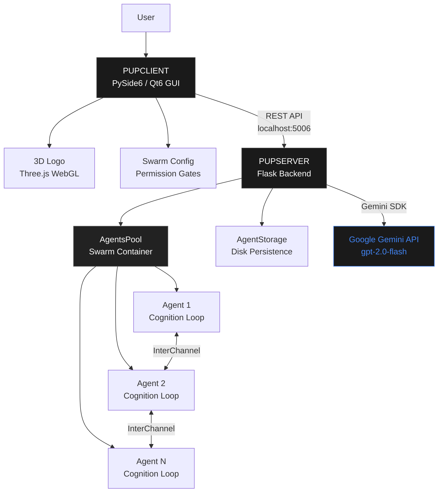

<div align="center">


<br>

***"The macOS native AI swarm orchestration system."***

*Multiple AI agents. One unified interface. Zero friction.*

<br>


<br>

<a href="https://skillicons.dev">
  
</a>

</div>

<br>

<p align="center">
  
</p>

<br>

---

## What is PUPPETEER?

PUPPETEER is a desktop orchestration platform that lets multiple AI agents coordinate in real-time. Each agent maintains its own conversation, memory, and task queue. They talk to each other through inter-agent channels. And critically — humans remain in control. Every sensitive action requires your approval before execution.

Built for macOS. Built with precision. Built to stay.

---

## Features

<br>

<table>
<tr>
<td width="50%">

**Swarm Intelligence**

Multiple AI agents working in parallel, delegating tasks, asking each other questions, building knowledge together. No bottleneck. No single point of failure.


</td>
<td width="50%">

**Human in the Loop**

Agents can't execute arbitrary code. They ask first. You approve. This is desktop automation that respects your machine.


</td>
</tr>
<tr>
<td width="50%">

**Task Orchestration**

Hierarchical task trees with real-time status. See what every agent is working on. Pause, resume, or reassign at will.


</td>
<td width="50%">

**Agent Memory**

Each agent maintains long-term facts and learned context. Compress chat history when needed. Query memory at any time.


</td>
</tr>
<tr>
<td width="50%">

**System Monitor**

Live CPU, memory, disk, and network metrics. Agent count and uptime at a glance.


</td>
<td width="50%">

**Liquid Silver**

A living, breathing 3D chrome marionette suspended by physics-simulated ropes. Hand-crafted in Three.js. Organic motion via Simplex Noise. 60fps on every Apple Silicon Mac.

</td>
</tr>
</table>

<br>

<p align="center">
  
</p>

---

## Install

**Step 1 — Download**

Visit the [**Releases**](https://github.com/AmirYassin/PUPPETEER-releases/releases) page and download the latest `.dmg` file.

**Step 2 — Install**

Open the DMG. Drag <kbd>PUPPETEER.app</kbd> to your <kbd>Applications</kbd> folder.

**Step 3 — Launch**

From **Applications**, double-click <kbd>PUPPETEER</kbd>. First launch is cinematic.

---

## Verify

Confirm your download is genuine before running:

```bash
# Verify code signature
codesign --verify --deep --strict /Applications/PUPPETEER.app
# Expected: /Applications/PUPPETEER.app: valid on disk

# Verify Apple notarization
spctl -a -t open --context context:primary-signature -v /Applications/PUPPETEER.app
# Expected: /Applications/PUPPETEER.app: accepted — source=Notarized Developer ID
```

---

## Architecture



---

## Stack

| Component | Version | Purpose |
|-----------|---------|---------|
| **Python** | 3.14 | Core runtime |
| **PySide6** | 6.11 | GUI framework (Qt6) |
| **Flask** | 3.1 | REST API backend |
| **Gemini AI** | 2.0-flash | LLM reasoning engine |
| **Three.js** | r160+ | 3D logo rendering (WebGL) |
| **Nuitka** | 4.0 | Native C compilation |
| **NodeGraphQt** | 0.6 | Visual agent topology graph |
| **macOS** | 15.0+ | Target platform |

---

## Configuration

Set your API key in `~/.zshrc`:

```bash
export GEMINI_API_KEY="your-gemini-api-key-here"
```

Get a free key at [Google AI Studio](https://aistudio.google.com/app/apikey).

On first launch, PUPPETEER creates its workspace at:

```
~/Library/Application Support/PUPPETEER/
├── agents_data/        # Agent state, memories, chat histories
├── logo_config.json    # 3D logo physics and material tuning
└── config.json         # Runtime settings (timeouts, ports, etc.)
```

---

## Performance

Compiled to a native macOS binary via Nuitka — not interpreted Python.

| Metric | Value |
|--------|-------|
| **Startup time** | < 2 seconds from double-click |
| **Execution model** | Direct machine code, zero interpreter overhead |
| **UI frame rate** | 60fps on all animations |
| **Memory baseline** | ~200 MB |

---

<details>
<summary><strong>System Requirements</strong></summary>

<br>

| Requirement | Minimum | Recommended |
|-------------|---------|-------------|
| **macOS** | 15.0 (Sequoia) | Latest |
| **Chip** | Apple Silicon M1 | M3 / M4 |
| **RAM** | 4 GB | 8 GB |
| **Disk** | 1 GB free | 2 GB free |
| **Network** | Required for Gemini API | — |
| **API Key** | Google Gemini API key | — |

> Apple Silicon (arm64) only. Universal2 binaries are on the roadmap.

</details>

---

<details>
<summary><strong>Troubleshooting</strong></summary>

<br>

**App won't open**

The app is notarized by Apple. If Gatekeeper still blocks it, go to **System Settings > Privacy & Security** and click **Open Anyway**.

**Agents timeout**

Increase `think_cooldown` in the settings panel (default 10s, max 60s).

**3D logo not rendering**

Requires hardware-accelerated WebGL. All Apple Silicon Macs support this — try quitting and relaunching.

**Server won't start**

Check if port 5006 is already in use:

```bash
lsof -i :5006
```

Kill the conflicting process, then relaunch.

</details>

---

<details>
<summary><strong>Changelog</strong></summary>

<br>

### v1.0.15
- Native compilation via Nuitka with LTO optimization
- Apple Notarized and Stapled — fully Gatekeeper-ready
- Inside-out cryptographic signing (SOTA codesign strategy)
- Data file relocation for codesign compliance
- Modular Forge integration for agent tooling
- Accessibility improvements across all widgets

### v1.0.0
- Initial release
- Multi-agent swarm orchestration
- Liquid Silver 3D chrome logo (Three.js / Cannon.es physics)
- Human-in-the-loop permission gating
- Persistent agent memory and history compression
- Flask REST API + PySide6 GUI hybrid architecture

</details>

---

## License

Copyright &copy; 2026 Amir Yassin. All rights reserved.

Personal and educational use on macOS only. Redistribution, reverse engineering, or commercial use without explicit written permission is prohibited.

---

## Support

[Open an Issue](https://github.com/AmirYassin/PUPPETEER-releases/issues) &nbsp;&middot;&nbsp; [View Releases](https://github.com/AmirYassin/PUPPETEER-releases/releases)

---

<br>

<p align="center">
  <sub>Built with intention. Shipped with conviction.</sub>
</p>
