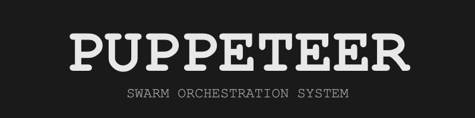
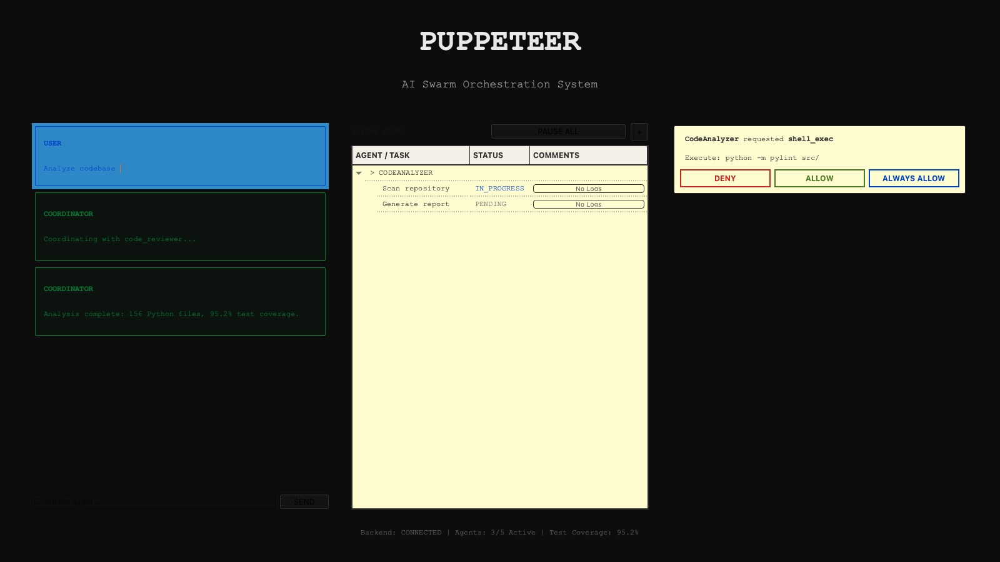

 

  

***"Multiple AI agents. One unified interface. Zero friction."***

 

  

&nbsp;&nbsp;

 

 

  

macOS native AI swarm orchestrator. Signed & Apple Notarized.

 

Copyright &copy; 2026 Amir Yassin. All rights reserved.

